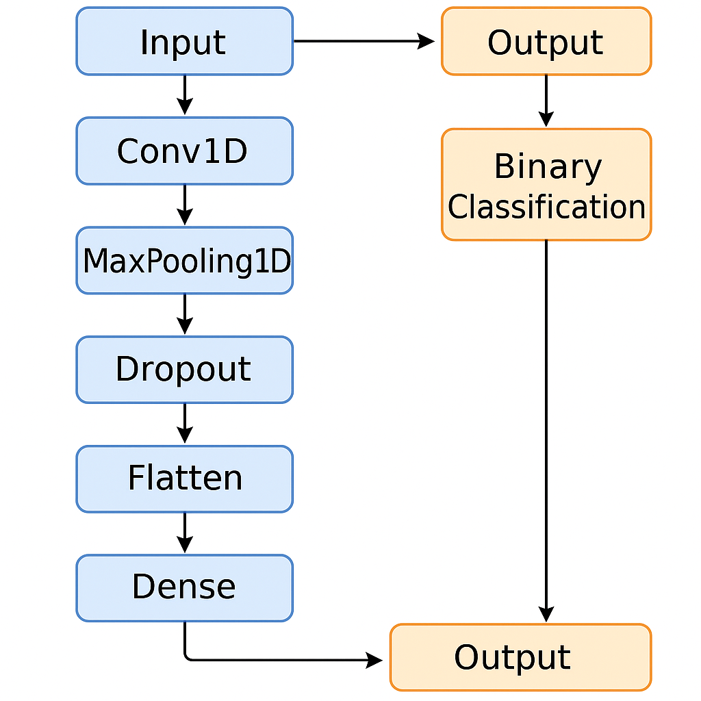

# Computational Solutions for Cardiovascular Diagnostics


## ECG Analysis with Hybrid CNN-SVM

_All research and materials were produced during my tenure as Research Assistant at Georgia Tech's Cardiovascular Fluid Mechanics Laboratory. The code, data, and insights are property of Georgia Tech and all collaborators involved in this project._

---

## 🔍 Overview

This research was conducted to address a critical healthcare challenge: **heart disease**—the world’s leading cause of death. We focused on using non-invasive ECG signal analysis for early detection.

The system merges **Convolutional Neural Networks (CNNs)** and **Support Vector Machines (SVMs)** into a hybrid model. Our goal: to deliver high-accuracy predictions while maintaining interpretability and clinical relevance.

---

## 🧠 What We Built

We designed a **hybrid CNN-SVM model** that combines the strengths of deep learning and traditional machine learning.

- **The Approach**: CNNs for automatic feature extraction, SVMs for final classification.
- **Key Features**:  
  - Temporal: QRS duration, RR intervals  
  - Spectral: Fast Fourier Transform (FFT) frequency-domain features
- **Why It Works**: CNNs capture important biomedical patterns across datasets without manual tuning.

---

## 📊 The Results

- Achieved **100% classification accuracy** on both training and validation sets.
- Strong performance highlighted potential **overfitting**, which is being addressed through regularization and more robust validation strategies.

---

## 👨‍🔬 My Role

As **Research Lead**, I drove the entire lifecycle of the project:

- Designed the machine learning pipeline and implemented core feature extraction.
- Led a team of research assistants and coordinated all technical development.
- Collaborated with practicing clinicians to ensure medical applicability.
- Published in peer-reviewed venues and presented at academic conferences.

---

## 🛣️ What’s Next

- **Reducing Overfitting**:  
  Employing data augmentation, cross-validation, L2 regularization, and dropout layers.
  
- **Real-World Deployment**:  
  Integrating the system into clinical workflows to support fast, accurate diagnostics.
  
- **Expanded Testing**:  
  Scaling evaluation to larger and more diverse patient cohorts.

---

## 📝 Publications

- **_Automated Detection of Heart Disease Using PhysioNet ECG Signals and Machine Learning Models_**, *2024 5th International Conference on Machine Learning and Computer Application (ICMLCA)*, *5th October 2024*


## ⚙️ Methodology

This project implements an **end-to-end ECG classification pipeline** using a **1D Convolutional Neural Network (CNN)** paired with **K-Fold Cross Validation** and multiple performance metrics.

### 📁 1. Data Input & Preprocessing

- Read ECG signals from PhysioNet files (`.dat` and `.hea`)
- Segment each signal into fixed-length windows (e.g., 5000 samples)
- Normalize values and reshape to match Conv1D input
- Apply light Gaussian noise for data augmentation

---

### 🧱 2. CNN Architecture

Regularized 1D-CNN built for biomedical time-series data:

```python
# Pseudocode architecture
Conv1D(filters=32, kernel_size=3, activation='relu')
MaxPooling1D(pool_size=2)
Dropout(0.25)

Conv1D(filters=64, kernel_size=3, activation='relu')
MaxPooling1D(pool_size=2)

Flatten()
Dense(64, activation='relu')
Dense(1, activation='sigmoid')  # Binary classification
```

#### CNN Architecture



---

### 🔁 3. Training Strategy: K-Fold Cross Validation

- **5-fold cross-validation** to ensure generalization
- Train on noise-augmented signal batches
- Evaluate with the following metrics per fold:
  - Accuracy and loss curves
  - Confusion matrix
  - ROC curve + AUC

---

### 🧩 4. End-to-End Workflow

High-level visualization of the full classification pipeline:


---
